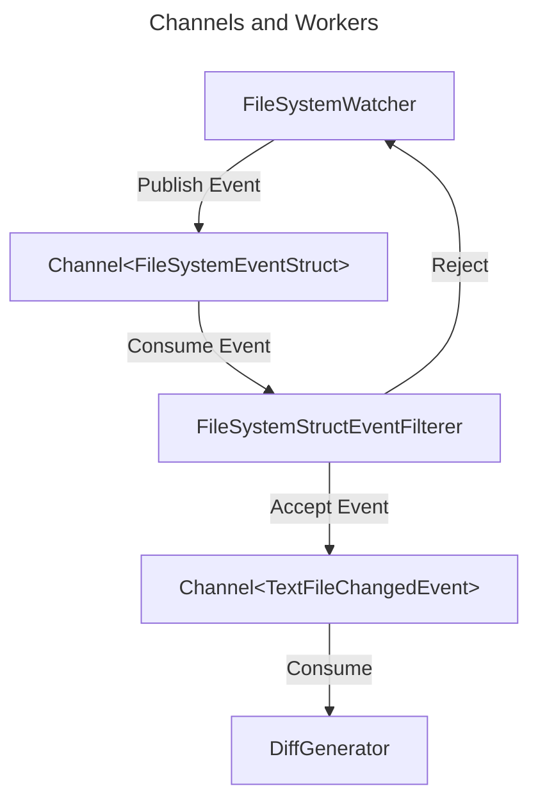
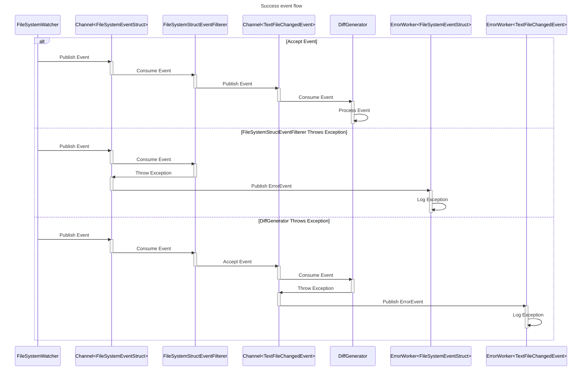

# FileSystemWatcher sample

## Intro

The sample demostrates how to create a watch command that will observe a file directory for changes. The design of the app
allows to get all the file system events as fast as possible into a Channel<FileSystemEventStruct> which is used a as a queue
to process the events. The app will process the events using a worker that will filter the events and will send them to 
a second Channel<TextFileChangedEvent>. The events from the second channel will be processed by any workers that have been registed
to the second channel.

## Channels and Workers

The following diagram shows how a single event will be process from the FileSystemWatcher delegates to the final worker that will
process it.



The above diagram shows the flow of a single event from the FileSystemWatcher to the final worker that will process the event. In this case
if an event is regected by the FileSystemStructEventFilterer it will be discarded and the FileSystemWatcher will continue to listen for new events. 


Marille supports IWorkers to throw exceptions in their ConsumeAsync methods. This is useful to be able to track problems when processing an event. Whenever
a worker throws an exception the channel will continure puiblishing and consuming events yet a IErrorWorker will receive a new event with the exception. Each channel must have
a IErorWorker that will process the exceptions. 



### Creation and Registration

The following code is the one that is used to create the channels and workers. 

```csharp
  // workers 
  var eventFilter = new FileSystemStructEventFilterer (hub);
  var diffGenerator = new DiffGenerator (snapshot);

  // error workers
  var fsEventsErrorHandler = new FileSystemEventStructErrorHandler ();
  var textFileChangedErrorHandler = new TextFileChangedErrorHandler ();

  // channel configurations
  var fsEventsConfig = new TopicConfiguration { Mode = ChannelDeliveryMode.AtLeastOnceSync };
  var txtEventsConfig = new TopicConfiguration { Mode = ChannelDeliveryMode.AtMostOnceAsync };

  // create the channels and registed the workers 
  await hub.CreateAsync (nameof(FileSystemWatcher), txtEventsConfig, textFileChangedErrorHandler,
    diffGenerator);
  await hub.CreateAsync (nameof(FileSystemWatcher), fsEventsConfig, fsEventsErrorHandler, eventFilter);
```

In the above code we do the following:

1. Create a new instance of the FileSystemStructEventFilterer and DiffGenerator. This will be the workers
   that will process the events.
2. Create a new instance of the FileSystemEventStructErrorHandler and TextFileChangedErrorHandler. This will be the error workers
   that will process any possible exceptions that are thrown by the consuming workers. Each worker will be registed to a specific channel.
3. Use the hub to create the channels and workers. The hub will create the channels and workers and will registed the workers to the channels.
   Each channel will have a specific configuration that will define how the events will be delivered.

### FileSystemStructEventFilterer implementation

The FileSystemStructEventFilterers job is to filter the events that are not text files. The worker will use the IsValidMimeType method to verify the 
MIME type of the file. If the MIME type is not 'text/*' or 'application/json' the event will be rejected and the worker will return false. 

IsValidMimeType implementation:

```csharp
protected bool IsValidMimeType (string path)
{
  var mime = MimeGuesser.GuessFileType (path);
  Log.Information ("Mime type for {Path} is {Mime}", path, mime.MimeType);
  return mime.MimeType switch {
    "application/json" => true,
    var str when str.StartsWith ("text/") => true,
    _ => false,
  };
```

Filtering the event:

```csharp
TextFileChangedEvent? textFileChangedEvent = default;

switch (currentMessage.ChangeType) {
case WatcherChangeTypes.Changed:
case WatcherChangeTypes.Created: {
  if (IsValidMimeType (currentMessage.FullPath))
    textFileChangedEvent = TextFileChangedEventFactory.FromFileSystemEventStruct (currentMessage);
  break;
}
case WatcherChangeTypes.Deleted:
  textFileChangedEvent = TextFileChangedEventFactory.FromFileSystemEventStruct (currentMessage);
  break;
case WatcherChangeTypes.Renamed:
  if (currentMessage.DestinationFullPath is not null && IsValidMimeType (currentMessage.DestinationFullPath))
    textFileChangedEvent = TextFileChangedEventFactory.FromFileSystemEventStruct (currentMessage);
  break;
}
```

Publishing the event if it was accepted:

```csharp
if (textFileChangedEvent is not null)
  await _hub.PublishAsync (nameof(FileSystemWatcher), textFileChangedEvent.Value);
```

### DiffGenerator implementation

The DiffGenerator worker will process the events that are text files. The worker will read the file and will generate a diff of the file. The idea of the 
worker is to show the differences between the current file and the previous file and perform a CPU intensive operation. 

The first thing to note is that the DiffGenerator states that is a CPU intensive operation by implementing the UseBackgroundThread property and returning true. This will
allow the hub to run the worker ConsumeAsync method in a background thread as opposed to the current thread, which is what happens when the IWorker is IO bound (the default).

```csharp
public bool UseBackgroundThread => true;
```

The ConsumeAsync implemtation is more complicated. The first thing it does is to determine what type of event we have received and then will generate a diff based on the event
type. For example, if the event is a WatcherChangeTypes.Created the worker will read the file and will generate a diff with the new content, if it is a modify event the worker will
compare the current content of the file with the content that it had when it took a snapshot of the file.

```csharp
public async Task ConsumeAsync (TextFileChangedEvent currentMessage, CancellationToken token = default)
{
  Log.Information ("Consuming event {Event}", currentMessage);
  // ignore events without a path
  if (currentMessage.Path is null)
    return;

  // depending on the event type we will take different actions
  var task = currentMessage.Flags switch {
    TextFileChangedType.ItemRemoved => ConsumeRemoved (currentMessage, token),
    TextFileChangedType.ItemCreated => ConsumeCreated (currentMessage, token),
    TextFileChangedType.ItemModified => ConsumeModified (currentMessage, token),
    TextFileChangedType.ItemRenamed => ConsumeRenamed (currentMessage, token),
    _ => throw new InvalidOperationException ($"Unhandled event type {currentMessage.Flags}"),
  };
  await task;
}
```

As you can see the DiffGenerator worker takes advantage of the Marille Exception support and it throws a InvalidOperationException if the event type is not handled. This will allow the hub to catch the exception and to process 
it in the appropiate ErrorWorker.

### ErrorWorkers

The project contains two different error workers with a very simple implementation. Both workers will log the exception that they receive. 

**TextFileChangedErrorHandler**

```csharp
using Marille.FileSystem.Events;
using Serilog;

namespace Marille.FileSystem.Workers;

public class TextFileChangedErrorHandler : IErrorWorker<TextFileChangedEvent> {
	public bool UseBackgroundThread => false;
	public Task ConsumeAsync (TextFileChangedEvent message, Exception exception, CancellationToken token = default)
	{
		Log.Error (exception, "Error processing event {Event}", message);
		return Task.CompletedTask;
	}

	public void Dispose () { }

	public ValueTask DisposeAsync () => ValueTask.CompletedTask;
}
```

**FileSystemEventStructErrorHandler**

```csharp
using Marille;
using Serilog;

namespace FileSystemWatcher.Workers;

public class FileSystemEventStructErrorHandler : IErrorWorker<FileSystemEventStruct> {

	public bool UseBackgroundThread => false;

	public Task ConsumeAsync (FileSystemEventStruct message, Exception exception, CancellationToken token = default)
	{
		// log the error and the event that caused it, there is not much we can do about it
		Log.Error (exception, "Error processing event {Event}", message);
		return Task.CompletedTask;
	}

	public void Dispose () { }

	public ValueTask DisposeAsync () => ValueTask.CompletedTask;
}
```

## Events

Marille is very opinionated about the events that can be used in the system. Because events can be consumed by more than one
worker it is important to make sure that workers do not mess with the event data while another worker is consuming it (we allow parallel execution). 
To prevent this Marille limits events to be struct. As structs are value types they are copied when passed to a worker. This means that the worker can 
modify the event without affecting the original event. 

Because of the above mentioned limitation, the sample needs to convert the FileSystemEventArgs events from the FileSystemWatcher to a struct before it is
published to the channel. The following code shows how the FileSystemEventStruct is created.

```csharp
public static FileSystemEventStruct FromEventArgs (FileSystemEventArgs args)
{
  return new(args.ChangeType, args.FullPath);
}

public static FileSystemEventStruct FromRenamedEventArgs (RenamedEventArgs args)
{
  return new FileSystemEventStruct (args.OldFullPath, args.FullPath);
}
```

## Main Loop

Marilles consuming loops are executed in the current thread. Because of that it is important to make sure that the consuming loop does not block the thread. Teh FileSystemWatcher also 
uses the current thread to raise events. If both the Hub and the FileSystemWatcher are running in the same thread it is possible that the FileSystemWatcher will block the Hub from processing,
we can avoid the situation by running the hub in a background thread:

```csharp
// we need to create several things to be able to get the events:
// 1. Hub: will be used to deliver the events to the consumers.
// 2. Worker: will be used to process the events.
// 3. FSMonitor: will be used to monitor the file system and deliver the events to the hub.
var hub = new Hub ();

// because we are going to start a main loop in the main thread, we need the channel initialization to be
// done in a background thread else we will be blocked.
Task.Run (async () => {

  // workers will be disposed by the hub
  //var worker = new LogEventToConsole ();
  var eventFilter = new FileSystemStructEventFilterer (hub);
  var diffGenerator = new DiffGenerator (snapshot);

  var fsEventsErrorHandler = new FileSystemEventStructErrorHandler ();
  var textFileChangedErrorHandler = new TextFileChangedErrorHandler ();

  var fsEventsConfig = new TopicConfiguration { Mode = ChannelDeliveryMode.AtLeastOnceSync };
  var txtEventsConfig = new TopicConfiguration { Mode = ChannelDeliveryMode.AtMostOnceAsync };
  await hub.CreateAsync (nameof(FileSystemWatcher), txtEventsConfig, textFileChangedErrorHandler,
    diffGenerator);
  await hub.CreateAsync (nameof(FileSystemWatcher), fsEventsConfig, fsEventsErrorHandler, eventFilter);
  Log.Information ("Channels created");
});
```

To be able to pump events from the FileSystemWatcher we need to register to the different events that the FileSystemWatcher raises. 
The following code shows how to register to the events:

```csharp
// create a watcher with the needed delegates that will pump the events to the channels
using var watcher = new System.IO.FileSystemWatcher("/Users/mandel/Xamarin/");

watcher.NotifyFilter = NotifyFilters.Attributes
                       | NotifyFilters.CreationTime
                       | NotifyFilters.DirectoryName
                       | NotifyFilters.FileName
                       | NotifyFilters.LastAccess
                       | NotifyFilters.LastWrite
                       | NotifyFilters.Security
                       | NotifyFilters.Size;

void OnEventRaised (object _, FileSystemEventArgs args)
{
  if (!hub.TryPublish (nameof(FileSystemWatcher), FileSystemEventStruct.FromEventArgs (args))) {
    Log.Error ("Could not publish {Event}", args);
  }
}

watcher.Changed += OnEventRaised;
watcher.Created += OnEventRaised;
watcher.Deleted += OnEventRaised;
watcher.Renamed += OnEventRaised;

watcher.Error += (_, args) => {
  Log.Error ("Error on with event {Args}", args);
};

watcher.Filter = "*.txt";
watcher.IncludeSubdirectories = true;
watcher.EnableRaisingEvents = true;
```

The TryPusblish method allows to publish an event from a sync method and will return false if the event could not be published, false otherwise. 
This method will fail if we are trying to publish an event in a bounded channel and the channel is full. 

